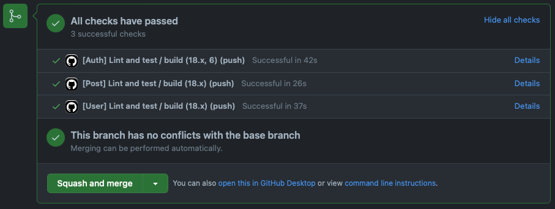

# GQL federation monorepo

This is a monorepo for a GraphQL federation project. it contains the following apps:

- auth - rest api [README](apps/auth/README.md)
- user - subgraph [README](apps/user/README.md)
- post - subgraph [README](apps/post/README.md)

The following tools are used:

- [nestjs](https://nestjs.com/) for backend framework
- [apollo-server](https://www.apollographql.com/docs/apollo-server/) for GraphQL server
- [apollo-federation](https://www.apollographql.com/docs/federation/) for GraphQL federation
- [prisma](https://www.prisma.io/) for database access
- [pnpm](https://pnpm.io/) for package management
- [turborepo](https://turbo.build/) for monorepo management
- [eslint](https://eslint.org/) for linting
- [prettier](https://prettier.io/) for formatting
- [jest](https://jestjs.io/) for testing

## Project structure

```sh
.
├── README.md
├── apps # contains all services
│   ├── auth # rest api
│   ├── post # post subgraph
│   └── user # user subgraph
├── docker
│   └── docker-compose.yml
├── docs
├── infra # contains all infrastructure related code
├── package.json # contains dependencies for monorepo
├── packages # config-* for shared configurations
│   ├── config-eslint
│   ├── config-jest
│   ├── config-ts
│   └── toolkit # shared code
├── pnpm-lock.yaml
├── pnpm-workspace.yaml
└── turbo.json # turborepo setup
```

Any code changes made to individual app or package will trigger a separate Github Actions workflow.



Shared configurations are located in `packages/config*`.

## Dependencies

```sh
pnpm i -w
```

## Generate supergraph schema

**Start all services**

Please note, there are prerequisites for [auth service](apps/auth/README.md).

```sh

pnpm dev
```

**Generate supergraph**

[Rover CLI](https://www.apollographql.com/docs/rover/) is used to generate supergraph schema. Configuration file is located at `scripts/rover.config.yaml`.

File generated to `scripts/supergraph.gql`

```sh

pnpm supergraph
```

## Start Apollo Router

Start Apollo Router in hot-reload mode. Changes made to router.yaml or supergraph.gql will be automatically reloaded.

```sh
pnpm start:router
```
