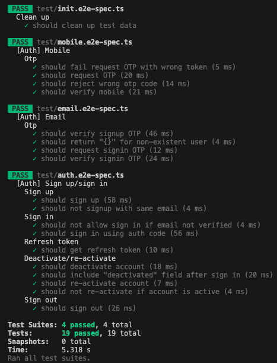
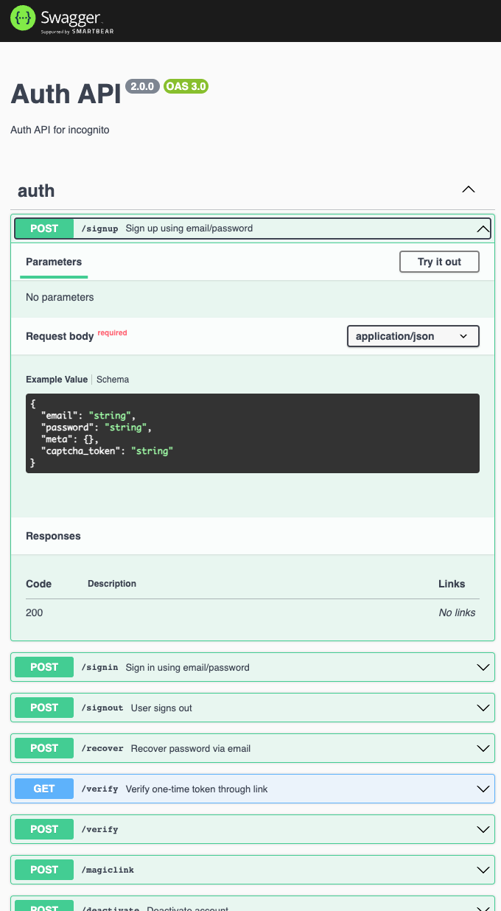

# Auth Service

REST API based auth service backed by Postgresql.

## Prerequisites

- PostgreSQL is required for auth service. Use `docker/docker-compose.yml` to start one.
- Run `pnpm --filter auth migrate:dev` to initialise the database.

## Running the app

```bash
# development
$ pnpm --filter auth dev

# production
$ pnpm --filter auth start:prod
```

## Test

```bash
# unit tests
$ pnpm --filter auth test

# e2e tests
# prepare database
$ pnpm --filter auth db:push:test
$ pnpm --filter auth test:e2e

# test coverage
$ pnpm --filter auth run test:cov
```



## Swagger

Visit http://localhost:3001/api


